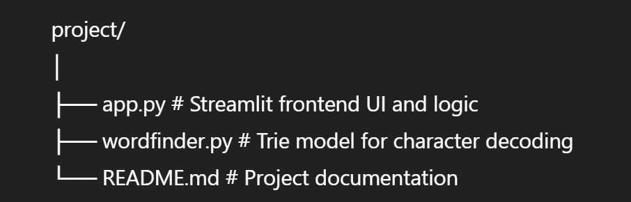

# Your Blind_Teacher

This project is a **custom input interface** built using **Streamlit**, designed to simulate a V-shaped soft keyboard and decode character sequences into letters using a **Trie-based language model**.

Users can interact by:
- Pressing on-screen buttons (`1`–`6`, `Enter`)
- Using mapped keyboard keys (like `d`, `w`, `q`, etc.)
- Receiving real-time decoding based on trie-defined sequences.

---

## Core Concepts Used

### Trie (Prefix Tree)
A **Trie** is used to map sequences of characters (like `dw`, `dkq`, etc.) to final letters (like `b`, `m`, etc.). This enables:
- Fast prefix matching
- Efficient character decoding

###  Streamlit
A fast, interactive UI framework used to:
- Display input/output fields
- Render buttons in a **V-shaped layout**
- Handle real-time user interaction

###  JavaScript (Embedded)
Used within Streamlit to:
- Capture browser key presses
- Trigger corresponding button clicks in the UI

---

##  Project Structure

# Features

Real-time decoding on any input change (add/delete)  
Keyboard key support:  
  - `d` → `1`  
  - `w` → `2`  
  - `q` → `3`  
  - `k` → `4`  
  - `o` → `5`  
  - `p` → `6`  
Output becomes **bold** when `Enter` is pressed  
Decoding uses a custom Trie dictionary  

---

##  Example

- Press: `1` → `d`
- Then: `2` → `e`
- Then: `4` → `k`
- Input box: `dek`
- Press `Enter`
- Output becomes: **ce** (decoded from `dk` → `c`, `e` is unmatched)

---

##  How It Works

1. **Buttons or keystrokes** build a string (`input_string`)
2. `TrieModel.decode_input_string()` processes this string:
   - Scans left to right
   - Picks the **longest valid prefix** match in the Trie
   - Appends decoded characters to output
3. Streamlit re-renders UI with the decoded `output_string`

---

##  Run the App

Make sure you have Python 3.8+ installed.

### 1. Install dependencies
```bash
pip install streamlit

